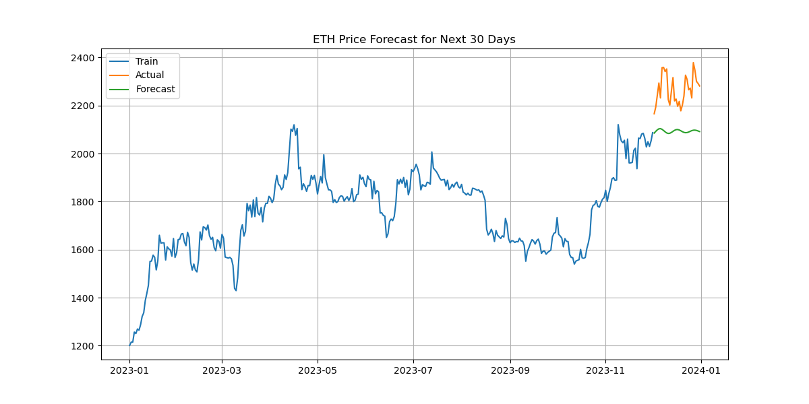

# ETH Price Forecasting using ARIMA

This project forecasts the closing price of Ethereum (ETH-USD) using historical data and the ARIMA (AutoRegressive Integrated Moving Average) time series model. The model is built, trained, and evaluated using Python with `statsmodels` and `matplotlib`.

## Project Description

This repository contains code to:

- Preprocess Ethereum closing price data
- Split the data into training and test sets
- Fit an ARIMA(5,1,0) model
- Forecast the next 30 days of prices
- Visualize and evaluate the prediction performance

The model achieves a **MAPE of 7.61%** and an **RMSE of 184.09**, making it a reasonably accurate short-term forecasting model.

## Dataset

- Dataset used: `ethereum_price_data.csv`
- Source: Historical data of ETH-USD
- Columns used: `Date`, `Close`

## Output Graph

This graph compares the actual vs forecasted ETH prices for the last 30 days.

## How to Run

## How to Run

1. Clone this repository: git clone https://github.com/DeepInsightCoder/Ethereum-ARIMA-Forecast.git
   
2. Install dependencies: pip install pandas numpy matplotlib statsmodels scikit-learn

## Model Summary
Model Used: ARIMA(5,1,0)

Libraries: pandas, matplotlib, statsmodels

Evaluation Metrics:

RMSE: 184.09

MAPE: 7.61%

## Author
Ayesha Tariq
GitHub: DeepInsightCoder

## License
This project is licensed under the [MIT License](LICENSE).

   

